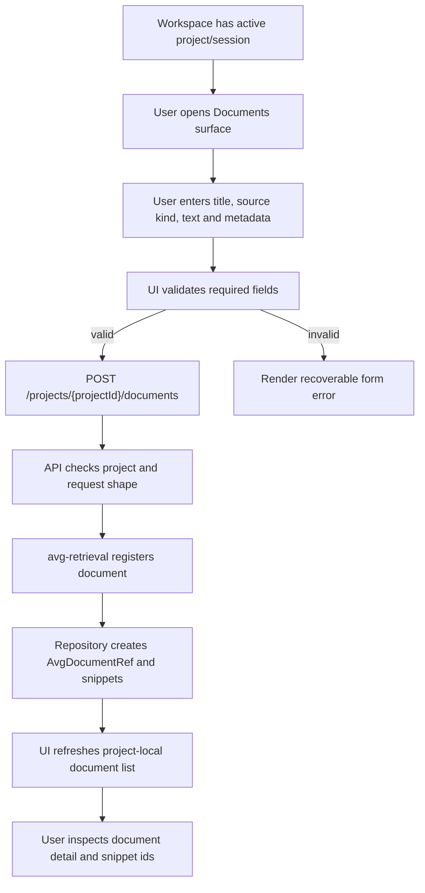

# Document Workspace Registration Flow

## Status

Draft for Sprint 7 / AVG-704.

## Context

AVG-704 turns the existing MVP-4 document registration boundary into a visible MVP-5 workspace surface. The user should be able to register local text or markdown as project evidence, inspect the resulting document record and snippet ids, and understand that the evidence is project-local.

This flow must not make the Documents surface feel like a global knowledge base. A registered document is an input for the active project, not direct access to Reality, not an account-level library, and not a source that can silently affect another project.

## Decision

The Documents surface owns document registration, project-local document listing, document detail, snippet preview and invalid-registration errors.

The surface uses the frozen local API boundary:

```http
POST /projects/{projectId}/documents
```

The API delegates to `packages/avg-retrieval`, which stores local source text, creates an `AvgDocumentRef`, chunks the text into deterministic `AvgSourceSnippet` records, and keeps all reads scoped to `project_id`.

The browser workspace must display:

- active project id and session id from the workspace shell;
- local-only boundary;
- registration form with title, source kind, text and optional metadata;
- document list scoped to the active project;
- selected document detail with document id, source kind, created timestamp and metadata;
- generated snippet ids and snippet text previews;
- visible errors for empty text, unsupported source kind, invalid JSON or unknown project.

## Flow



## Usage

Registration request:

```json
{
  "title": "Strategy notes",
  "source_kind": "local_markdown",
  "text": "Document text for local MVP retrieval.",
  "metadata": {
    "origin": "manual"
  }
}
```

Successful response:

```json
{
  "document": {
    "id": "doc_001",
    "project_id": "project-7",
    "title": "Strategy notes",
    "source_kind": "local_markdown",
    "created_at": "2026-05-20T00:00:00.000Z",
    "metadata": {
      "origin": "manual"
    }
  }
}
```

The UI should then show the returned document reference and the snippet preview available from the same project-local retrieval repository. Snippet ids follow the deterministic repository pattern, for example `snip_doc_001_001`, and citation ids later follow the matching retrieval pattern, for example `cit_doc_001_001`.

## UI States

| State | Required Rendering |
|---|---|
| Empty | Documents surface says no local documents exist yet and keeps the local-only boundary visible. |
| Editing | Form keeps title, source kind, text and metadata visible without changing active project/session identity. |
| Submitting | Surface keeps the active project visible and avoids clearing existing document detail. |
| Registered | Document list includes id, title, source kind and created timestamp for the active project only. |
| Detail selected | Detail panel shows document id, project id, source kind, metadata and generated snippet ids. |
| Invalid | Error boundary names the failed field or API code and keeps the user input recoverable. |

## Failure Modes

| Failure | Expected Code Or Source | UI Boundary |
|---|---|---|
| Empty title, text or source kind | local form validation or `DOCUMENT_TEXT_REQUIRED` | Do not mark the document as accepted evidence; keep the form editable. |
| Unsupported source kind | retrieval validation | Show the allowed source kinds: `local_text`, `local_markdown`, `local_document`. |
| Unknown project | API project lookup | Stop registration and state that the active project could not be found. |
| Invalid JSON | `INVALID_JSON` | Show request parse failure without exposing internal traces. |
| Cross-project document access | project scoped list/detail guard | Do not render the document in the active project surface. |

## Boundary Rules

- Documents are evidence inputs inside the active project scope.
- Registered source text is not a system prompt, instruction channel or hidden behavior switch.
- Snippet ids must stay visible because later grounded answers cite snippets, not whole documents.
- Retrieval confidence remains a risk signal in the Retrieval surface, not proof of truth.
- The Documents surface must not introduce upload dependencies, OCR, external web ingestion, production storage, authentication, permissions or organization sharing.

## Acceptance Checklist

- User can register `local_text` or `local_markdown` against the active project.
- Registered documents appear only in the active project document list.
- User can inspect document id, project id, source kind, metadata and generated snippet ids.
- Invalid submissions produce clear, recoverable errors.
- Local-only and project-local boundaries are visible in empty, form, list and detail states.
- Contract tests continue to cover the route shape if request or response handling changes.

## Links

- `docs/00-product/mvp-5-working-interface-plan.md`
- `docs/05-ui-ux/mvp-5-interface-contract.md`
- `docs/04-api/mvp-5-ui-api-boundary.md`
- `docs/04-api/retrieval-api-contract.md`
- `docs/02-ai-system/retrieval-grounding-contract.md`
- `packages/avg-retrieval/README.md`
- `apps/api/README.md`
- `.codex/war-room/AVG-704-task-card.md`
